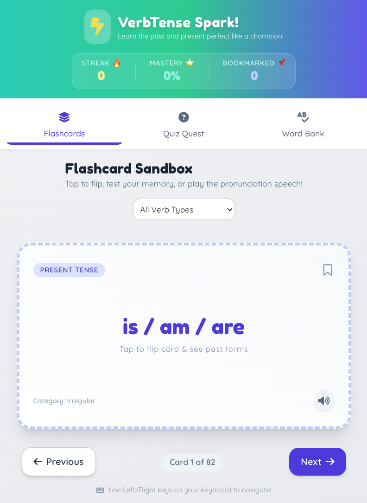
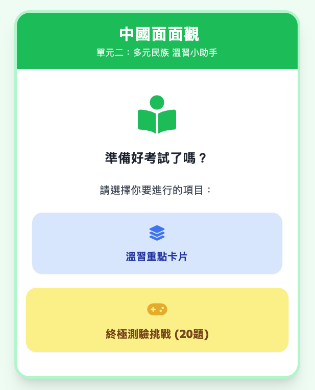
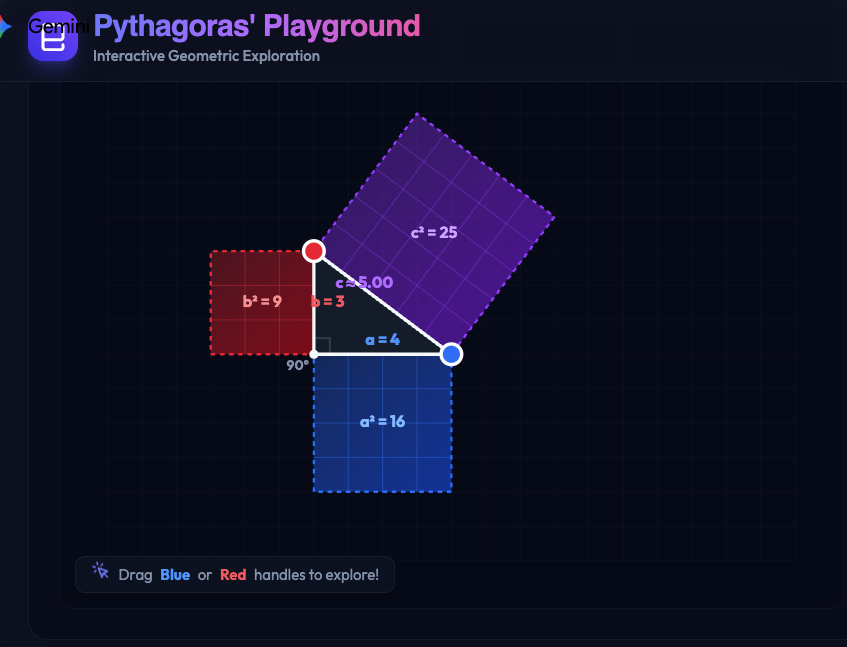
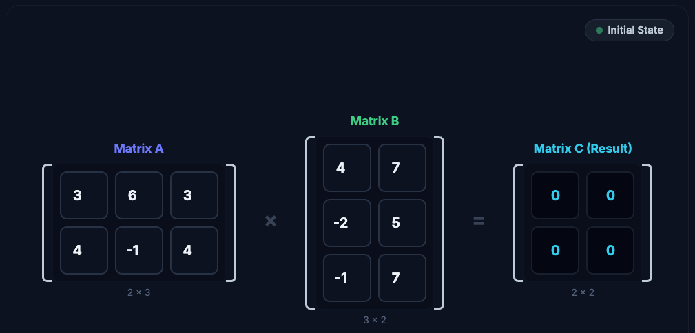

# Practical GenAI Skills for Educators


This page is aimed to provide educators with practical GenAI skills that can be applied in their teaching and learning activities. It covers a range of topics, including useful keyboard shortcuts, popular GenAI tools, effective prompting techniques, and managing prompts and AI responses. By mastering these skills, educators can enhance their teaching methods and provide a more engaging learning experience for their students.

# Hello! My name is Sunny 🌞


[Sunny Ng](https://training.imagenation.com.hk/#sunny-ng)  
**Founder / Master Trainer** at [Image Nation](https://training.imagenation.com.hk)  
**Part-time Lecturer** at HKU Business School, HKU School of Chinese, HKUSPACE, EdUHK  
**Email**: sunny.ng@imagenation.com.hk or sunnyng@eduhk.hk

# Useful Keyboard Shortcuts

| Keyboard Shortcut | Description                                         |
| ----------------- | --------------------------------------------------- |
| `SHIFT` + `ENTER` | Move cursor to next line without sending out prompt |
| `CTRL` + Click    | Open a link in a NEW browser tab                    |
| `CTRL` + `Z`      | Undo last action                                    |
| `CTRL` + `C`      | Copy selected text                                  |
| `CTRL` + `V`      | Paste copied text                                   |
| `WIN` + `D`       | Show Windows Desktop                                |
| `CTRL` + `F`      | Search on the current page                          |
| `ALT` + `=`       | Insert / Edit LaTex                                 |

# Popular GenAI Tools

It is more effective to keep multiple browser tabs open for different tools.

To open the following AI tools in a **NEW** browser tab, hold `CTRL` (`CMD` on Mac) when clicking the links below.

- [Gemini](https://gemini.google.com) - Google Gemini is a powerful, multimodal large language model developed by Google that can understand and process a wide range of information, including text, images, canvas (apps),audio, and video.
- [Perplexity](https://www.perplexity.ai) - AI search engine that provides concise answers with sources.
- [Microsoft Copilot](https://copilot.microsoft.com/) - Free Microsoft AI assisant.
- [Grok](https://grok.com) - AI tool for generating text and code.
- [Poe](https://poe.com) - Platform to access multiple AI models in one place.
- [Qwen](https://chat.qwen.ai) - Conversational AI for various tasks
- [Doubao](https://www.doubao.com) - Conversational AI for various tasks
- [DeepSeek](https://www.deepseek.com) - Conversational AI for various tasks (**NOT** a multi-modal tool)
- [VisualGPT](https://visualgpt.io) - Photo Editor with AI / Image Generation
- [LMArena](https://lmarena.ai) - Compare and explore different large language models.
- [Notion AI](https://www.notion.com) - Note-taking and productivity app with AI features.
- [Napkin AI](https://www.napkin.ai/) - The visual AI for business storytelling.
- [Canva](https://www.canva.com) - Graphic design platform with AI-powered tools. Great for PowerPoint Generation.

# More on Popular AI Tools

- [Microsoft 365 Copilot](https://m365.cloud.microsoft/) - AI assistant integrated into Microsoft 365 apps.
- [narakeet](https://www.narakeet.com/languages/chinese-text-to-speech/) - Easily Create Voiceovers Using Realistic Text to Speech
- [ElevenLabs](https://elevenlabs.io) - AI-powered text-to-speech platform.
- [Cleanvoice AI](https://cleanvoice.ai) - Audio editing tool that removes filler words, stutters, and long pauses from audio recordings.
- [Yeri AI](https://yeri.ai/) - Open-source image generation model. Previously know as Stablediffusion.
- [Kling AI](https://app.klingai.com) - AI-powered video creation platform.
- [Hailuo AI](https://hailuoai.video) - AI-powered video creation platform.
- [Runway](https://runwayml.com) - AI-powered video editing and creation
- [newarc](https://www.newarc.ai/) - AI-powered fashion creative platform.
- [Tripoai](https://studio.tripo3d.ai) - AI-powered 3D content creation platform.
- [ideogram](https://ideogram.ai/) - AI-powered image generation platform.

# Other Tech Tools for Teaching & Learning

- [Google Sites](https://sites.google.com/) - Free website builder by Google, great for creating a class website or portfolio.
- [DILLINGER](https://dillinger.io/) - Online Markdown playground/editor.
- [Pandoc](https://pandoc.org/index.html) - Universal document converter that can convert between various formats, including Markdown, HTML, PDF, and more.

# Mastering RICE FACT Effective Prompting

RICE FACT is a useful framework to help you structure your prompts effectively when using AI tools. It stands for Role, Instruction, Context, Example, Format, Action, Constraint, and Tone. By incorporating these components into your prompts, you can guide the AI to generate more accurate and relevant responses.

There are other prompting frameworks such as **ICIO** (Instruction, Context, Input, Output), **SCQA** (Situation, Complication, Question, Answer) and **STAR** (Situation, Task, Action, Result), they all have their own advantages and disadvantages. RICE FACT is more comprehensive and flexible, allowing you to include various elements in your prompts to achieve better results.

**Beginner Pitfall**: AI beiginner users tend to use simple **Instruction-only** prompts, which often lead to vague and irrelevant responses. By adding more prompt components such as Role, Context, Example, Format, Action, Constraint, and Tone, you can significantly improve the quality of the AI's responses.


**Tips 1**: You can just click the copy button to replicate the prompt in your AI ssistant. It's OKAY to include the RICE FACT tags in your prompt.  
**Tips 2**: In your furture prompting, You DON'T actually have to specifically add these tags in your prompts. They are just there to help you better understand the prompt structure.  
**Tips 3**: It's NOT common to include all RICE FACT components in a single prompt.  
**Tips 4**: In some articles, A is referred as Action while some other articles refer to it as Audience. You can choose either one depending on the context of your prompt.

**Instrustion** only

```
Role        →
Instruction → Explain what GenAI is.
Context     →
Example     →
Format      →
Action      →
Constraint  →
Tone        →
```

---

**Instruction** + **Format**

```
Role        →
Instruction → Explain what GenAI is.
Context     →
Example     →
Format      → Use one sentence.
Action      →
Constraint  →
Constraint  →
```

---

**Role** + **Instruction** + **Format**

```

Role        → You are a secondary teacher.
Instruction → Explain what GenAI is.
Context     →
Example     →
Format      → Use one sentence.
Action      →
Constraint  →
Tone        →

```

---

**Role** + **Instruction** + **Format**

```

Role        → You are a kindergarten teacher.
Instruction → Explain what GenAI is.
Context     →
Example     →
Format      → Use one sentence.
Action      →
Constraint  →
Tone        →

```

---

**Role** + **Instruction** + **Context**

```

Role        → You are a tech trainer.
Instruction → Explain what GenAI is.
Context     → The target audience are non-technical executives.
Example     →
Format      →
Action      →
Constraint  →
Tone        →

```

---

**Instruction** + **Format**

```
Role        →
Instruction → Explain what GenAI is.
Context     →
Example     →
Format      → Use three bullet points.
Action      →
Constraint  →
Tone        →
```

---

**Instruction** + **Format** + **Constraint**

```
Role        →
Instruction → Explain what GenAI is.
Context     →
Example     →
Format      → Use three bullet points.
Action      →
Constraint  → Each bullet points not more than 15 words.
Tone        →
```

---

**Instruction** + **Example**

```
Role        →
Instruction → Generate 10 dummy customer records as below
Context     →
Example     → CustID, CustName, Email, Mobile, Address
Format      →
Action      →
Constraint  →
Tone        →
```

---

# Managing Prompts and AI Responses

To effectively manage your prompts and the AI's responses, it's important to keep a record of your interactions. This can help you track the effectiveness of different prompts and refine your approach over time. You can use tools like **Notion** (or **Microsoft Loop**, or **Mem**) to document the AI's responses, and any notes on what worked well or what could be improved. This practice will enable you to build a library of effective prompts that you can refer back to in the future.


Notion is a great tool for this purpose because it allows you to organize your prompts and responses in a structured way, making it easy to review and analyze your interactions with the AI.

It supports rich **block types**, such as text, headings, bullet points, tables, and more, which can help you format your notes effectively. You can also use Notion's database features to create a searchable library of prompts and responses, making it easier to find specific interactions when needed.


## Let's Practice Notion

- Addding New Page
- Giving Page Title
- Add a banner image to theme a page
- Add icon to make the page more recognizable
- Adding images
- Adding embedded videos
- Adding Google Map
- Cross-devices features

# Power Point Generation using Canva AI


Canva is a graphic design platform that offers AI-powered tools to help you create visually appealing presentations. With Canva's AI features, you can generate PowerPoint slides quickly and easily by providing simple prompts. This can be especially useful for educators who want to create engaging presentations without spending too much time on design.

**Exercise**:  
To practice using Canva AI for PowerPoint generation, we will feed contents that we previous gererated using GenAI tools such as Gemini or Perplexity into Canva AI to create visually appealing slides.

# Image Generation using Gemini (Nano Banana)


When you instruct Gemini to generate images, Nano Banana will be activated to create images based on your prompts. You can specify the style, content, and other parameters to get the desired images for your teaching materials or presentations.

**Text to Image**

You can simply describe the image you want to generate in your prompt, and Gemini will create an image based on your description. For example, you can ask Gemini to generate an image of a `sunny beach with palm trees and clear blue water` or `a futuristic city skyline at night`. The more detailed your description, the better the generated image will match your expectations.

**Image-to-Image Editing**

You can feed image and ask Gemini to edit the image(s) based on your instructions. For example, you can ask Gemini to change the background of an image, add or remove certain elements, or apply specific filters to enhance the visual appeal of the image.

**Image as Style Reference**

You can also feed image as style reference and instruct Gemini to use it as target style to edit your own image in the same style.

# Speech Synthesis


Speech synthesis, also known as text-to-speech (TTS), is a technology that converts written text into spoken words. With AI-powered TTS tools, you can create natural-sounding audio from your text content, which can be useful for creating audio materials for your students or for accessibility purposes.

Let's use [Narakeet](https://www.narakeet.com/app/text-to-audio/) for some fun.

For cantonese spoken script, you can use AI tools to convert written form to Cantonese spoken form.

For example:

```
Covert the following written Chinese to Cantonese spoken script
PASTE YOUR ORIGINAL TEXTS HERE
```

# Interactive Contents Generation


Gemini's canvas feature allows you to create interactive content such as quizzes, games, and simulations. You can design engaging activities for your students that can help them learn in a more interactive and enjoyable way. For example, you can create a quiz on a specific topic, or design a simple game that reinforces key concepts.

**Vibe Coding**

Canvas output form are actually self-contained mini web applications, which means you can easily share them with your students by providing a link. This makes it convenient for remote learning or for students to access the content on their own devices. If you can handle programming, you can even customize the canvas output further to suit your specific teaching needs. Of course vibe coding is mature enough and will offer you more flexibility and possibilities to create more advanced interactive content.

---

```
Create a flash card app to help school kid learn the tense of English words in the document.
```

Use the above prompt in Gemini to create your own canvas or click the link below to see my pre-generated canvas.

[Verb Tense Flash Card](https://gemini.google.com/share/41c1f6655195)


---

```
Generate a interactive revision app for my kid to do revision and prepare for exam.
```

Use the above prompt in Gemini to create your own canvas or click the link below to see my pre-generated canvas. I uploaded PDF file to serve as custom knowledge base for Gemini to generate the interactive revision app.

[Interactive Content for Revision](https://gemini.google.com/share/b28f691178e1)  


---

```
Create a playground for student to explore Pythagorean theorem
```

Use the above prompt in Gemini to create your own canvas or click the link below to see my pre-generated canvas.

[Playground for Pythagorean Theorem](https://gemini.google.com/share/a458c0cbdb1d)


---

```
generate an html animation to show the concept of binomial formula
```

Use the above prompt in Gemini to create your own canvas or click the link below to see my pre-generated canvas.

[Binomial Formula Animation V1](https://gemini.google.com/share/e91b2e1053c9)

---

```
create an interactive simulation to help students understand the concept of binomial formula
```

Use the above prompt in Gemini to create your own canvas or click the link below to see my pre-generated canvas.

[Binomial Formula Animation V2](https://gemini.google.com/share/d5fd067bae8d)

---

```
show a simple matrix calculation using html5 animation
```

Use the above prompt in Gemini to create your own canvas or click the link below tosee my pre-generated canvas.

[Matrix Calculation Animation](https://gemini.google.com/share/538eea044790)


---

```
generate a simulation to teach student about bubble sort for data structures and algorithm introduction
```

Use the above prompt in Gemini to create your own canvas or click the link below to see my pre-generated canvas.

[Bubble Sort Simulation](https://gemini.google.com/share/823e6da5ae2f)

---
